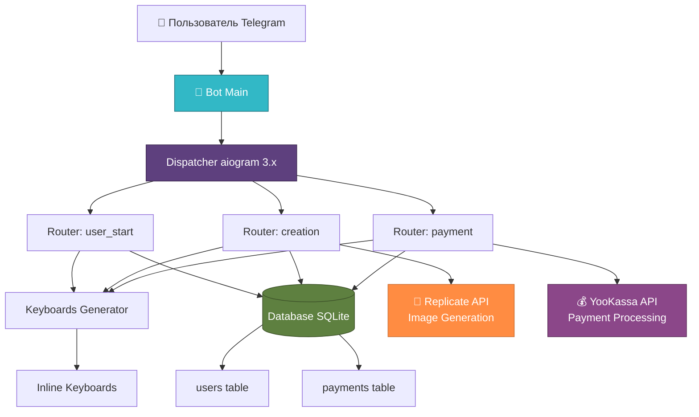
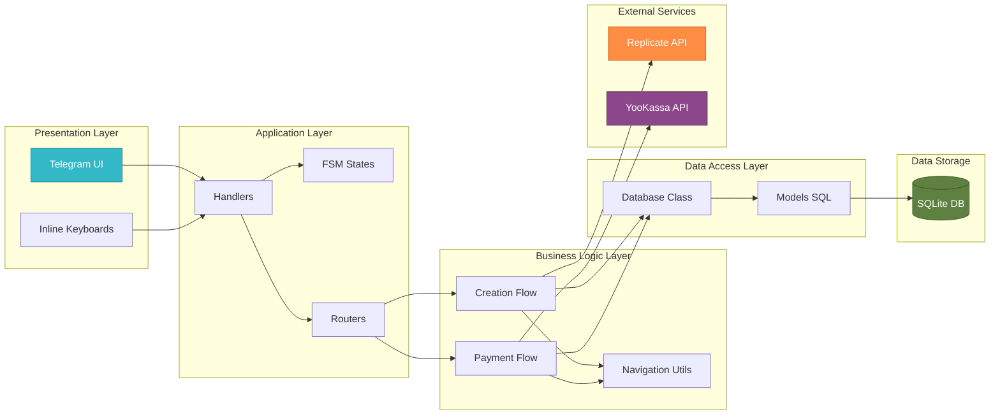
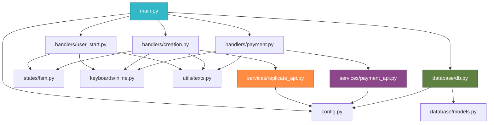
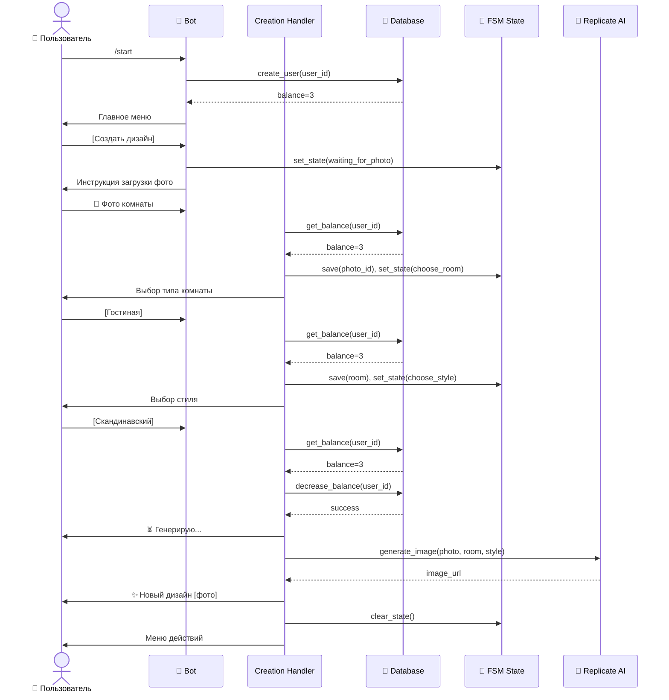
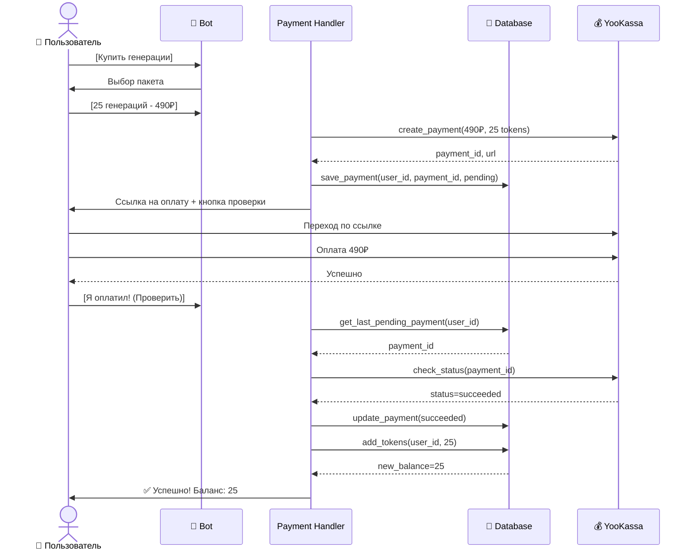

# InteriorBot v1 — Визуальная схема архитектуры

## Общая архитектура системы

## Архитектура по слоям

## Структура проекта (дерево зависимостей)

## Поток данных при генерации дизайна

## Поток данных при оплате

---

## Легенда

- 👤 **User** — Пользователь Telegram
- 🤖 **Bot** — Telegram Bot (aiogram)
- 🔄 **FSM** — Finite State Machine (машина состояний)
- 💾 **Database** — SQLite база данных
- 🎨 **Replicate** — AI сервис генерации изображений
- 💰 **YooKassa** — Платежный шлюз
