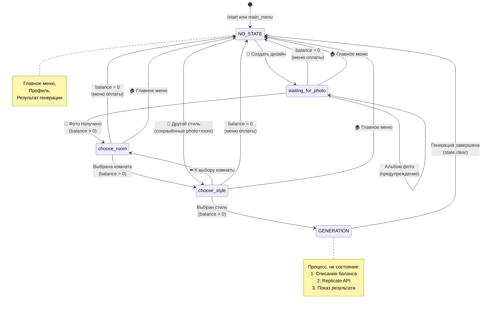
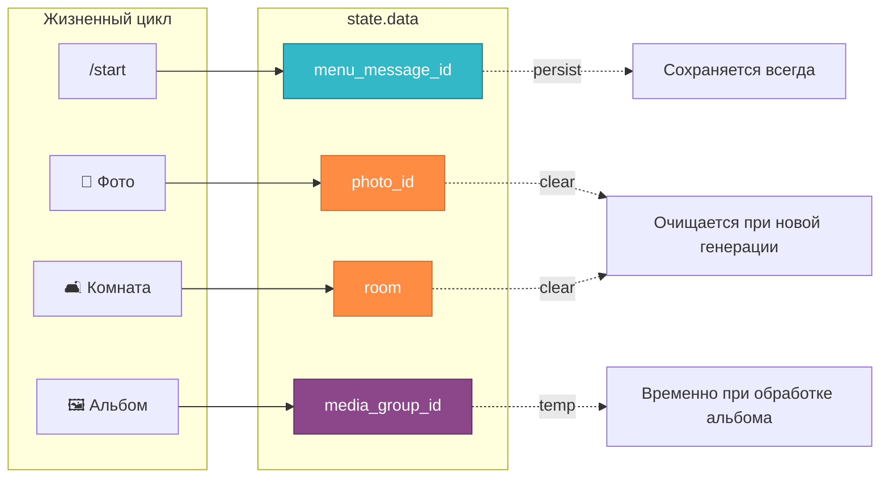
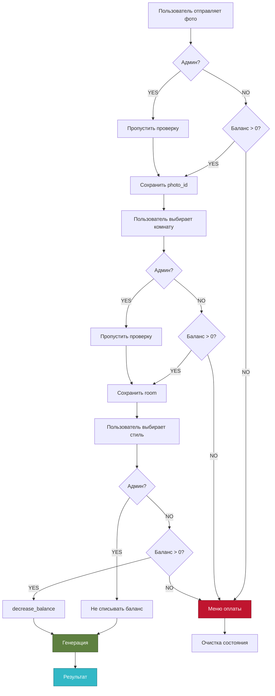

# InteriorBot v1 — FSM Состояния

## Граф состояний процесса создания дизайна



## Детальные переходы состояний

```mermaid
flowchart TD
    Start([/start]) --> CheckUser{Пользователь<br/>существует?}
    CheckUser -->|NO| CreateUser[create_user<br/>balance=3]
    CheckUser -->|YES| MainMenu
    CreateUser --> MainMenu[NO STATE<br/>🏠 Главное меню]
    
    MainMenu -->|[🎨 Создать дизайн]| WaitPhoto[waiting_for_photo<br/>📸 Ожидание фото]
    MainMenu -->|[👤 Профиль]| Profile[NO STATE<br/>👤 Профиль]
    
    WaitPhoto -->|📸 Фото| CheckBalance1{Баланс > 0?}
    CheckBalance1 -->|YES| SavePhoto[save photo_id]
    CheckBalance1 -->|NO| Payment[Меню оплаты]
    SavePhoto --> ChooseRoom[choose_room<br/>🛋️ Выбор комнаты]
    
    ChooseRoom -->|[Гостиная/Спальня/...]| CheckBalance2{Баланс > 0?}
    CheckBalance2 -->|YES| SaveRoom[save room]
    CheckBalance2 -->|NO| Payment
    SaveRoom --> ChooseStyle[choose_style<br/>🎨 Выбор стиля]
    
    ChooseStyle -->|[⬅️ К выбору комнаты]| ChooseRoom
    ChooseStyle -->|[Современный/...]| CheckBalance3{Баланс > 0?}
    CheckBalance3 -->|YES| Decrease[decrease_balance]
    CheckBalance3 -->|NO| Payment
    
    Decrease --> Generate[⏳ Генерация<br/>Replicate API]
    Generate --> ShowResult[✨ Показ результата]
    ShowResult --> ClearState[state.clear]
    ClearState --> Result[NO STATE<br/>🏞️ Результат]
    
    Result -->|[🔄 Другой стиль]| ChooseStyle
    Result -->|[📸 Новое фото]| WaitPhoto
    Result -->|[🏠 Главное меню]| MainMenu
    
    Payment --> MainMenu
    Profile --> MainMenu
    
    WaitPhoto -->|[🏠 Главное меню]| MainMenu
    ChooseRoom -->|[🏠 Главное меню]| MainMenu
    ChooseStyle -->|[🏠 Главное меню]| MainMenu
    
    style MainMenu fill:#32b8c6,stroke:#1d7480,color:#fff
    style WaitPhoto fill:#ff8c42,stroke:#cc7035,color:#fff
    style ChooseRoom fill:#ff8c42,stroke:#cc7035,color:#fff
    style ChooseStyle fill:#ff8c42,stroke:#cc7035,color:#fff
    style Generate fill:#8b4789,stroke:#5c2e5a,color:#fff
    style Result fill:#5e8040,stroke:#3d5229,color:#fff
```

## Данные в state.data



## Проверка баланса (многоуровневая)



---

## Резюме

**InteriorBot v1** использует:

- **3 основных состояния:** waiting_for_photo, choose_room, choose_style
- **1 базовое состояние:** NO_STATE (главное меню, профиль, результат)
- **Многоуровневую проверку баланса** на каждом шаге
- **Защиту от ошибок:** альбомы фото, нулевой баланс
- **Гибкую навигацию:** возврат на любой этап, главное меню доступно всегда
