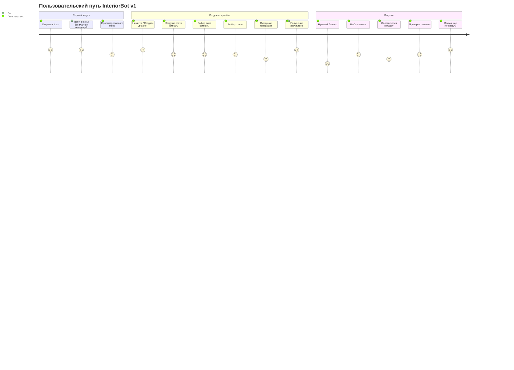
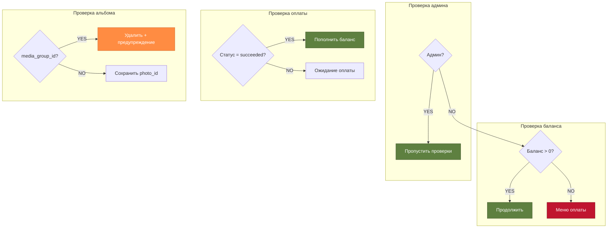

# InteriorBot v1 — Пользовательские сценарии

## Полный пользовательский путь (User Journey)



## Сценарий 1: Успешное создание дизайна

```mermaid
flowchart TD
    A[/start] --> B[Главное меню<br/>🎉 3 бесплатные генерации]
    B -->|[🎨 Создать дизайн]| C[📸 Отправьте фото комнаты]
    C --> D[Пользователь отправляет фото]
    D --> E[🛋️ Выберите тип комнаты]
    E -->|[Гостиная]| F[🎨 Выберите стиль]
    F -->|[Скандинавский]| G[⏳ Генерирую дизайн...]
    G --> H[✨ Ваш новый дизайн!<br/>📉 Баланс: 2]
    H -->|[🔄 Другой стиль]| F
    H -->|[📸 Новое фото]| C
    H -->|[🏠 Главное меню]| B
    
    style A fill:#32b8c6,stroke:#1d7480,color:#fff
    style G fill:#ff8c42,stroke:#cc7035,color:#fff
    style H fill:#5e8040,stroke:#3d5229,color:#fff
```

## Сценарий 2: Недостаточно баланса

```mermaid
flowchart TD
    A[Пользователь пытается<br/>создать дизайн] --> B{Баланс > 0?}
    B -->|NO| C[⚠️ У вас закончились<br/>бесплатные генерации]
    C --> D[💰 Выберите пакет]
    D -->|[10 - 290₽]| E[🔗 Ссылка на оплату]
    D -->|[25 - 490₽]| E
    D -->|[60 - 990₽]| E
    E --> F[Пользователь оплачивает]
    F --> G[🔄 Проверка платежа]
    G --> H{Оплачено?}
    H -->|YES| I[✅ Успешно!<br/>Баланс пополнен]
    H -->|NO| J[⏱️ Оплата не поступила]
    J --> G
    I --> K[🏠 Главное меню]
    
    style C fill:#c0152f,stroke:#801020,color:#fff
    style I fill:#5e8040,stroke:#3d5229,color:#fff
    style J fill:#ff8c42,stroke:#cc7035,color:#fff
```

## Сценарий 3: Альтернативные стили

```mermaid
flowchart LR
    A[✨ Результат<br/>Скандинавский стиль] -->|[🔄 Другой стиль]| B[🎨 Выбор стиля<br/>💾 photo_id, room сохранены]
    B -->|[Минимализм]| C[⏳ Генерация]
    C --> D[✨ Результат<br/>Минимализм]
    D -->|[🔄 Другой стиль]| B
    D -->|[📸 Новое фото]| E[📸 Загрузка фото]
    
    style A fill:#5e8040,stroke:#3d5229,color:#fff
    style B fill:#32b8c6,stroke:#1d7480,color:#fff
    style C fill:#ff8c42,stroke:#cc7035,color:#fff
    style D fill:#5e8040,stroke:#3d5229,color:#fff
```

## Навигационная карта (все возможные переходы)

```mermaid
graph TD
    Start([/start]) --> Main[🏠 Главное меню]
    
    Main -->|[🎨 Создать]| Photo[📸 Загрузка фото]
    Main -->|[👤 Профиль]| Profile[👤 Профиль]
    
    Photo --> Room[🛋️ Выбор комнаты]
    Room --> Style[🎨 Выбор стиля]
    Style --> Gen[⏳ Генерация]
    Gen --> Result[✨ Результат]
    
    Result -->|[🔄 Другой стиль]| Style
    Result -->|[📸 Новое фото]| Photo
    Result -->|[👤 Профиль]| Profile
    Result -->|[🏠 Главное меню]| Main
    
    Profile -->|[💰 Купить]| Packages[💰 Пакеты]
    Profile -->|[🏠 Главное меню]| Main
    
    Packages --> Payment[🔗 Оплата]
    Payment -->|[🔄 Проверить]| Check{Оплачено?}
    Check -->|YES| Success[✅ Успешно]
    Check -->|NO| Payment
    Success --> Main
    
    Packages -->|[⬅️ Назад]| Profile
    Packages -->|[🏠 Главное меню]| Main
    Payment -->|[⬅️ Назад]| Profile
    Payment -->|[🏠 Главное меню]| Main
    
    Photo -->|[🏠 Главное меню]| Main
    Room -->|[🏠 Главное меню]| Main
    Style -->|[⬅️ Назад]| Room
    Style -->|[🏠 Главное меню]| Main
    
    Photo -.->|balance=0| NoBalance[⚠️ Нет баланса]
    Room -.->|balance=0| NoBalance
    Style -.->|balance=0| NoBalance
    NoBalance --> Packages
    
    style Main fill:#32b8c6,stroke:#1d7480,color:#fff
    style Gen fill:#ff8c42,stroke:#cc7035,color:#fff
    style Result fill:#5e8040,stroke:#3d5229,color:#fff
    style Success fill:#5e8040,stroke:#3d5229,color:#fff
    style NoBalance fill:#c0152f,stroke:#801020,color:#fff
```

## Точки принятия решений



---

## Резюме

**InteriorBot v1** обеспечивает:

✅ **Линейный пользовательский путь** с 4 простыми шагами  
✅ **Гибкую навигацию** с возможностью вернуться  
✅ **Защиту от ошибок** на каждом этапе  
✅ **Прозрачную монетизацию** с 3 пакетами  
✅ **Быстрый результат** за ~60 секунд  
